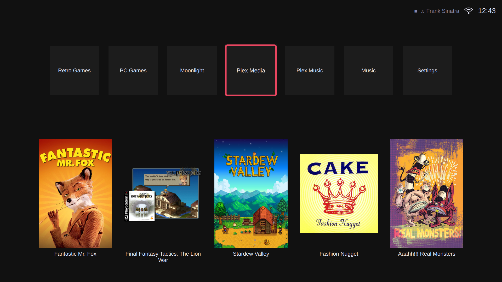
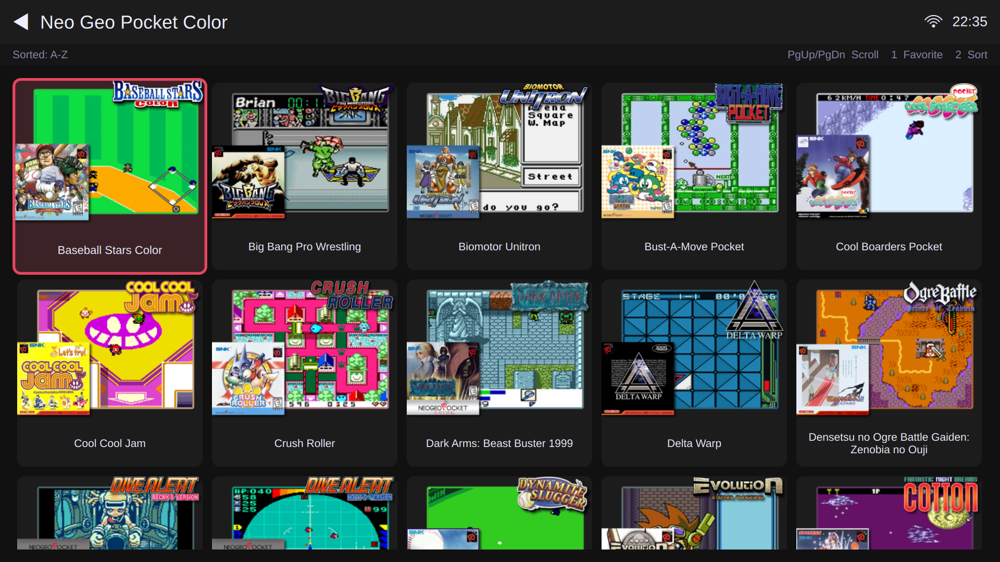
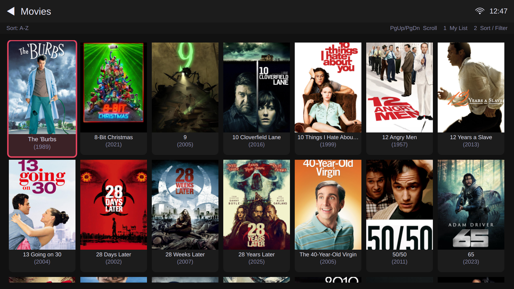
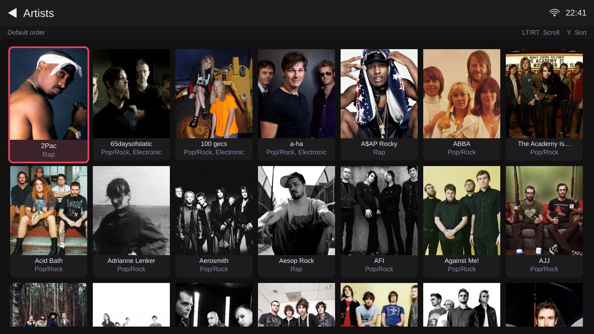
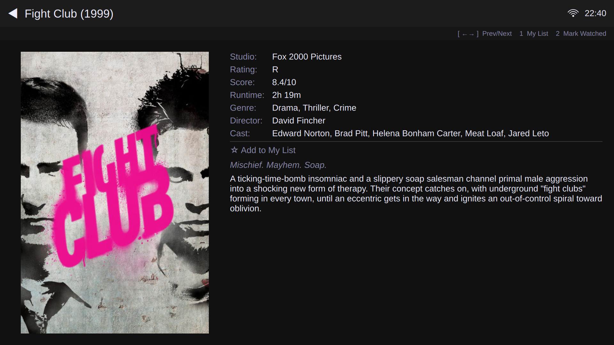
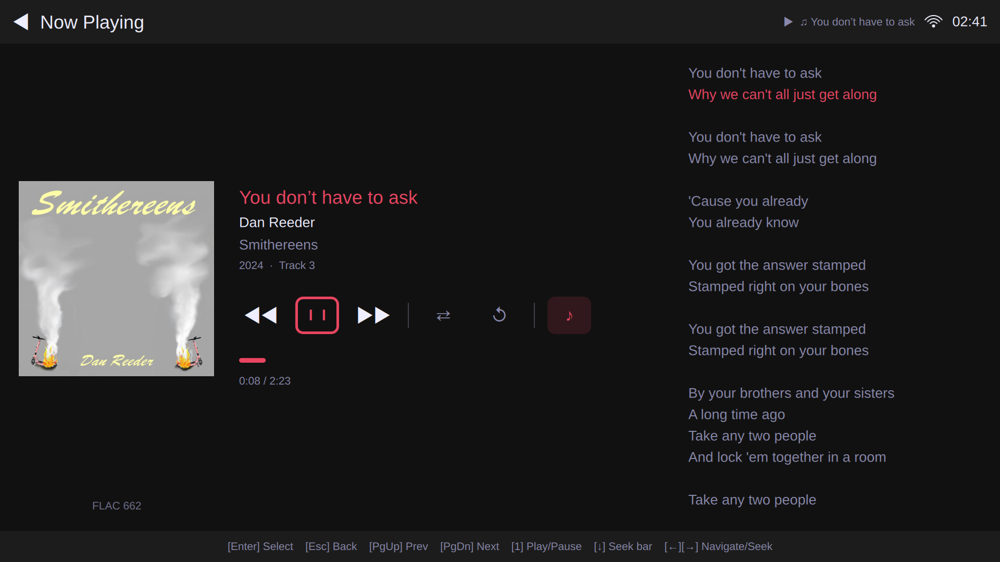

**Note: This is still very much a WIP** 

# HTPC Station

Turn a cheap mini PC into a console-like home entertainment system.

HTPC Station is a fullscreen, gamepad-first interface for Linux that brings together:
* Retro Games (RetroArch)
* PC Games (Steam)
* Game streaming (Moonlight)
* Movies & TV (Plex)
* Music (Plex)

-- all in one fast, couch-friendly UI.

No desktop clutter. No Mouse/keyboard required (but it also works great with a keyboard)


## Why This Exists

I wasn't happy with the existing software options for HTPC setup, so I made the program I wanted to use. All the things I care about in one performance-optimized interface.

HTPC Station is not a media player or emulator - it's the glue that ties them together.

## What It Feels Like

- Launch HTPC Station to open the fullscreen UI.  
- Pick up a controller.  
- Browse your games, movies, and music in one place  
- Launch anything in seconds  
- No mouse. No keyboard. No desktop navigation. 

## Screenshots

| | |
|---|---|
|  |  |
|  |  |
|  |  | 

---

## What You Can Do Today

**Games**

- Browse, sort, and launch your ROM collection with artwork, metadata, and video previews. 
- Configure controller mapping and RetroArch hotkeys in a user-friendly interface.
- Scan and jump into your Steam library.
- Use Moonlight to stream games from a Sunshine or Apollo host on your local network.

**Plex**

- Easily sign-in, browse, and watch your Plex media via direct-play.
- Seamlessly switch between Local vs. Remote Plex playback automatically.
- Browse and playback Live TV using an HDHomeRun tuner and Plex DVR.  
- Music has a full Now Playing screen with album art, track info, playback controls, and synced lyrics.
- Music keeps playing in the background while you browse other tabs or play a game.

### Controller and Navigation

- Full gamepad navigation throughout the entire interface.
- Configurable button mapping wizard for any controller.
- Keyboard navigation works everywhere as well.
- Action hints update automatically based on whether you are using a gamepad or keyboard.
- Press Start+Select together to close the Plex browser and return to HTPC Station.

---

## Getting Started

### What You Need

- A Linux PC (x86_64). Works well on low-power hardware like old thin clients.
- A gamepad or a keyboard.
- Python 3.10 or newer.
- **For retro games:** RetroArch installed (Flatpak recommended), plus ROMs with Batocera/Knulli/EmulationStation scraped metadata (`gamelist.xml` and artwork). HTPC Station does not scrape ROMs — prepare your library first.
- **For Steam games:** Steam installed (Flatpak or native).
- **For game streaming:** Moonlight installed (Flatpak recommended) and a Sunshine or Apollo host.
- **For Plex video playback:** MPV and its shared library installed (`sudo dnf install mpv mpv-libs` on Fedora, `sudo apt-get install mpv libmpv2` on Debian/Ubuntu). Hardware acceleration requires VA-API drivers — see the dependency checker output for your specific hardware and distro.
- **For Plex Live TV:** An HDHomeRun tuner connected through Plex DVR.
- **For Plex music and browser fallback:** Brave browser (Flatpak recommended).
- **For Plex:** A Plex account with access to a Plex Media Server. Local network direct-play is preferred.

### Installation

```bash
git clone https://github.com/htpcstation/htpcstation.git
cd htpcstation
bash install.sh
```

`install.sh` is an interactive CLI installer that:

1. **Detects** your OS (Debian/Ubuntu, Fedora, Arch, or other), graphics hardware (Intel, AMD, NVIDIA), and display server (Wayland or Xorg).
2. **Interviews** you — which tabs you want, where your ROMs live, your Plex server URL, whether you have an HDHomeRun tuner, and which PC game launchers you use.
3. **Checks dependencies** — lists every required package with a ✓/✗ status and the exact install command for your distro. Nothing is installed automatically in this version.
4. **Creates a Python venv** at `<repo>/venv/` and installs pip dependencies from `requirements.txt`.
5. **Writes** `~/.config/htpcstation/config.json` based on your answers (backs up any existing config first).
6. **Generates** `htpcstation.sh` — a launcher script that runs the app using the venv.

After `install.sh` completes, install any missing system packages it listed, then:

```bash
./htpcstation.sh
```

The app launches fullscreen. Sign in to Plex from the Settings tab.

#### Manual installation (advanced)

If you prefer to manage dependencies yourself:

```bash
# Check system prerequisites
bash scripts/check-deps.sh

# Install Python packages (system-wide or in your own venv)
pip install -r requirements.txt

# Run
python3 main.py
```

## 
> **Note:** If buttons seem swapped, run `mpv --input-gamepad=yes --input-test --force-window --idle --input-conf=/dev/null` and press each button to see what name MPV reports, then open an issue.

## Controller Reference

HTPC Station bindings 

| Button | Action |
|---|---|
| D-pad / Arrow keys | Navigate |
| A / Enter | Select / Launch |
| B / Escape | Back / Cancel |
| X / F1 | Favorite / My List toggle / Play-Pause (music) |
| Y / F2 | Sort / View menu; Subtitle selector (during MPV playback) |
| LT / RT (PgUp/PgDn) | Quick scroll (next letter or ±10 items) |
| Start / F10 | Quit dialog |
| Start + Select / Alt + F4 | Close Plex browser 

MPV Bindings

| Button | MPV Action |
|---|---|
| A / Space | Play / Pause |
| X / O | Show playback progress |
| Y / J | Cycle subtitle track |
| Left / Right | Seek ±10 seconds |
| Up/Down / 0/9 | Volume ±5 |
| LB / # | Cycle audio track |
| RB / — | Show track list |
| Start / Q/Escape | Quit (return to HTPC Station) |

---

## Current Limitations

- ROM scraping is not yet supported. You need another scraper to create `gamelist.xml` files and download artwork before HTPC Station can display your retro game metadata. Importing from Batocera or Knulli works great.
- Continue Watching is hidden for managed and kids Plex profiles. This is a Plex platform limitation with no known workaround.
- Changing which tabs are visible requires restarting the app.
- Moonlight host pairing must be done through Moonlight's own interface. You can open it from Settings by pressing "Open Moonlight."
- Large Plex audio playlists (over 1,000 tracks) are hidden to avoid performance issues.
- Live TV requires an HDHomeRun tuner connected through Plex DVR. Channels not available on the tuner show "Not available" in the guide.
- AV1 video content requires hardware decode support (Intel Gen 12+ / Tiger Lake or newer). On older hardware, set Video Quality to "Auto" in Settings — the app will detect unsupported codecs and request server-side transcoding to H.264.
- Only tested on Linux x86_64 with Xorg and Wayland (via XWayland for the Qt app; MPV uses native Wayland context).

---

## Future Goals

- Local  Music and Video libraries.
- Enhanced playlist options for music + videos, including shuffle videos.
- Streaming service integration via the browser extension framework.
- Tab management improvements so hiding or showing tabs does not require a restart.
- Metadata (descriptions, genres) for Moonlight apps pulled from Steam.
- Plex search + on-screen keyboard.
- First-run setup wizard (in-app complement to `install.sh`).
- Standalone emulator support (Dolphin, PCSX2, etc.) for systems without a libretro core.
- Theme engine.
- UX tweaks. 
- More ideas as I have them.
- Feel free to suggest more.

---

## Tech Stack

For those interested in what's under the hood:

| Component | Technology |
|---|---|
| Application framework | Qt 6 / QML with PySide6 (Python) |
| Target hardware | Intel J5005-class (Gemini Lake) or better |
| Target display | 1920x1080 fullscreen, Xorg or Wayland |
| Emulator backend | RetroArch via Flatpak |
| PC game launch | Steam URI protocol (`steam://rungameid/`) |
| Game streaming | Moonlight CLI (Flatpak) |
| Media browsing | Plex Media Server API |
| Video playback | libmpv (in-process, via python-mpv) with VA-API hardware decode + auto Plex server-side transcode |
| Live TV | HDHomeRun direct streams via Plex DVR + HDHomeRun guide API (`api.hdhomerun.com`) |
| Music playback | Qt MediaPlayer + AudioOutput (direct Plex audio streams) |
| Gamepad input | evdev with synthetic Qt key events |
| Browser gamepad | Chromium extension (Manifest V3) with Gamepad API |
| Configuration | JSON (`~/.config/htpcstation/config.json`) |

---

## Credits and Acknowledgments

As you can probably tell by looking at the code, I leveraged AI coding assistants to help build HTPC Station. I have nearly a decade of systems engineering experience, but I am not a full-stack developer by trade. That being said, the scope of this project balooned pretty quickly, and was by no means a small effort to get it to its current state.

This builds on the work of many excellent projects, either by directly implenting or by taking inspiration from: Qt and PySide6, RetroArch, Steam, Moonlight, Plex, MPV, Brave/Chromium, Pegasus, ES-DE, Batocera, Knulli, and others. Thank you to all the developers and communities behind these tools.

---

## Bug Reports

Please file any bugs via [GitHub Issues](https://github.com/htpcstation/htpcstation/issues).

---

## License

HTPC Station is released under the [MIT License](LICENSE).

**Dependency licensing note:** HTPC Station uses [python-mpv](https://github.com/jaseg/python-mpv) and [libmpv](https://mpv.io/), which are available under LGPLv2.1 or later (or GPLv2 or later at the user's option). HTPC Station links against libmpv dynamically via ctypes — this is dynamic linking, which is compatible with the LGPL. HTPC Station's own source code remains under the MIT License. If you distribute a build that statically links libmpv, the GPL terms apply to that build.
